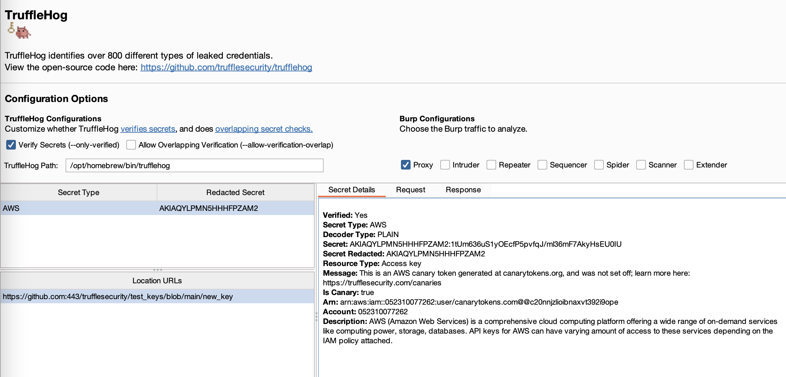
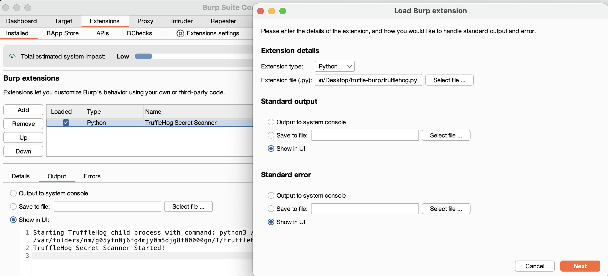
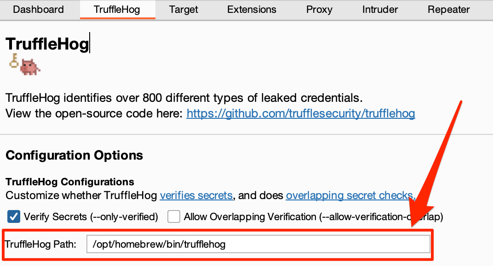
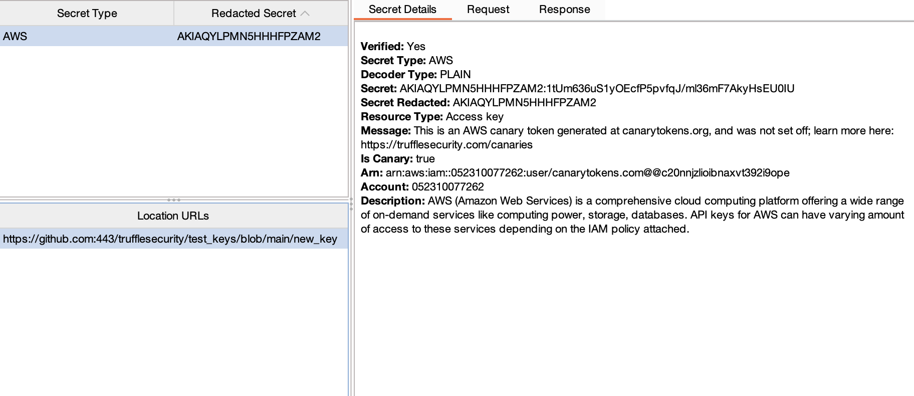

# TruffleHog Burp Suite Extension

Scan Burp Suite traffic for over 800+ different types of secrets (API keys, passwords, SSH keys, etc) using TruffleHog! 



## Quickstart

1. [Install TruffleHog](https://github.com/trufflesecurity/trufflehog?tab=readme-ov-file#floppy_disk-installation) if you haven't already.

2. Clone this repository to your local machine and load the extension in Burp Suite `Extensions -> Add -> Extension Type: Python > Extension File: trufflehog.py`.



3. If we can't automatically find the TruffleHog binary in your PATH, you'll need to specify the path to TruffleHog in the `TruffleHog` Burp Suite tab. This is super common behavior on OSX. You'll only need to do this once.



4. All results are displayed in the `TruffleHog` tab.

### Troubleshooting

**Seeing the error "Jython JAR file has not been configured"?**

Super easy fix. We built this extension in Python, so you'll need to configure a Jython JAR file in Burp Suite.

1. Download [Jython Standalone](https://repo1.maven.org/maven2/org/python/jython-standalone/2.7.4/jython-standalone-2.7.4.jar).
2. Go to `Extensions -> Extension Settings -> Python environment`.
3. Select the path to the `jython-standalone-2.7.4.jar` file for the "Location of Jython standalone JAR file" field.

## How it works

**tl;dr Every 10 seconds the extension runs TruffleHog to check for secrets in Burp Suite traffic.**

1. The extension writes all HTTP traffic (from the configured Burp Suite tools - proxy, repeater, intruder, etc.) to disk in a temp directory.
2. Every 10 seconds, the extension invokes TruffleHog to scan the files in that temp directory and then immediately deletes them.
3. If secrets are found, they're reported in the `TruffleHog` tab. When you click into a detected secret, the `Location URLs` table will populate all endpoints containing that exact secret. When you click on a specific URL, you'll see the secret details, as well as the actual request or response containing that secret.



**Note about Secret Results:** If "Verify Secrets" is enabled (default), the `TruffleHog` tab will only show secrets that are currently live.

**Note about Scanning Interval:** Because we're scanning in 10 second intervals, there may be a lag of up to 15 seconds between loading a page containing a secret and seeing it displayed in the `TruffleHog` tab.

**Note about Keyword Preflighting:** We separate the request/response headers from the request/response body content for analysis. We do this to add additional keyword context to the headers, which helps maximize the amount of secrets the extension can find. For more details, read about [keyword preflighting](https://trufflesecurity.com/blog/keyword-context-in-trufflehog).

#### Extension Reloading

If you reload the TruffleHog extension using Burp Suite Pro or Enterprise, your existing secrets *will* repopulate in the `TruffleHog` tab. If you're using Burp Suite Community, you'll need to re-scan the traffic to see the secrets (this is a limitation of Burp Suite Community and not this extension).

## (Optional) Configurations

Click on the `TruffleHog` tab to see available configuration options. 

*Note: When you make a configuration change, changes take effect automatically (there is no save button).*

### Burp Suite

By default, the extension will only scan *proxy* traffic. You can modify the configuration in the `TruffleHog` tab to scan other Burp Suite traffic (e.g., repeater, intruder, etc.). 


### TruffleHog

**Secret Verification is Enabled by default.** This means that the extension will attempt to verify each secret that it finds via an HTTP request. Read more about this [here](https://trufflesecurity.com/blog/how-trufflehog-verifies-secrets). You can turn this off by de-selecting the "Verify Secrets" checkbox. 

**Overlapping Secret Verification is Disabled by default.** This means that the extension will **not** allow overlapping secret checks. Read more about this [here](https://trufflesecurity.com/blog/contributor-spotlight-helena-rosenzweig-and-assetnote-team#:~:text=Imagine%20two%20companies,allow%2Dverification%2Doverlap.) You can turn this on by selecting the "Allow Overlapping Verification" checkbox. 


## Testing

To run the tests, use the following command:
```
pytest
```

The tests only cover the scanner.py file, which contains the core functionality of the secret scanning in this extension.

## ToDo

- [ ] Add a test suite for the Burp Suite specific code (`tab_ui.py` and `trufflehog.py`).
- [ ] Add in aho-corasick keyword preflighting to HTTP header files.
- [ ] Scan WebSocket traffic.
